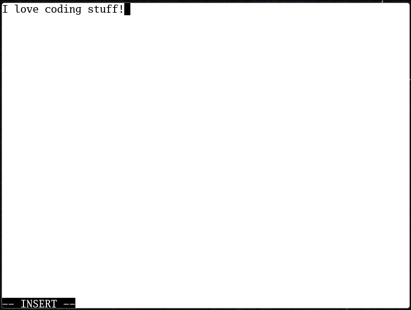

## Todo

- [x] Draw buffer text in multiple lines
- [x] Cursor indicator
- [x] Vim Modes
- [x] Separate globals in its own file
- [x] Vim Mode indicator
- [x] Scrolling
- [ ] Soft Wrapping
- [ ] Commands
- [ ] Open files
- [ ] Save files
- [ ] Vim motions
- [ ] Config via some small language, lua?
  - [Running a Lua Script from C](https://www.oreilly.com/library/view/creating-solid-apis/9781491986301/ch01.html)
- [ ] Mouse support
- [ ] Line numbers
- [ ] Line signs (the char before the line number)
- [ ] Themes
- [ ] Treesitter
- [ ] LSP

### Bugs

- [x] When on last character of line you cannot go up
- [x] When there are two newlines the cursor will jump up awkwardly
- [x] When you type a longer line then type two short ones, put cursor at the
      end of the first one and go down one, it will go down two lines
- [x] When you type two newlines one shows as a weird character
- [x] MEMORY LEAKS, arch crashes when I leave it running for a while :(
- [ ] When going up to the first line or down from the first line the jump will
      be 1 character off

### Optimizations

- [ ] Type_In_Buffer function probably has a horrible implementation

## Development

To run the program

```bash
./run.sh
```

To run the program with valgrind

```bash
./valgrind.sh
```

## Dependencies

```bash
sudo pacman -S cmake sdl2 sdl2_ttf
```

## Resources

- https://github.com/aminosbh/sdl2-ttf-sample
- https://cmake.org/cmake/help/v3.16/guide/tutorial/index.html
- https://discourse.libsdl.org/t/how-to-implement-a-ttf-font-file-in-c-source-code-or-binary-executable-file/9914
